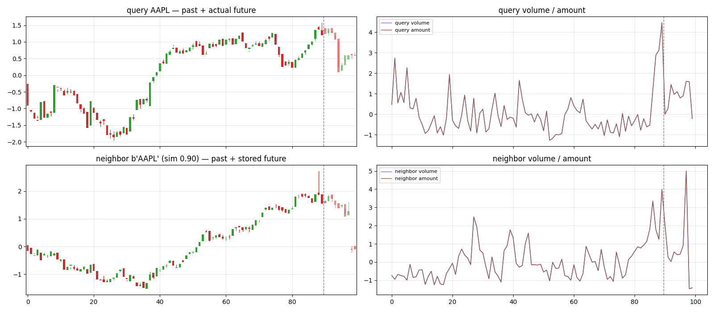

# Stock Market Kronos Prediction

Retrieval-augmented forecasting on top of [Kronos](https://github.com/shiyu-coder/Kronos), a foundation model for financial candlesticks.

Instead of applying hand-crafted trading rules to a candle sequence, we encode the sequence with Kronos, retrieve the most similar historical windows from a vector database, and forecast the next bars from what those similar patterns actually did.

## How it works

1. **Tokenize + embed** — each window of `lookback` normalized candles is tokenized (`KronosTokenizer`, binary spherical quantization) and run through the autoregressive `Kronos` predictor. The **final hidden state at the last position** (the context the model uses to predict the next token) is the window's embedding.
2. **Store** — embeddings are L2-normalized and stored in a `faiss.IndexFlatIP` (cosine similarity). Payloads keep the normalized future candles, the past series and the ticker.
3. **Retrieve** — a query window is embedded the same way and its `k` nearest neighbors are fetched.
4. **Forecast** — the expected next move is the similarity-weighted mean of the neighbors' realized moves (`softmax(sims / tau)`), or the retrieved futures are aggregated/plotted directly.

## Files

| File | Role |
|---|---|
| `main.py` | CLI entry point |
| `kronos_flax.py` | Flax NNX port of KronosTokenizer + Kronos (base/small/mini configs) |
| `transfer.py` | Loads official HuggingFace checkpoints and transfers weights into the Flax port |
| `fetch_data.py` | Alpaca minute-bar download + normalized window serialization |
| `dataset.py` | Grain dataloaders over the window files |
| `rag.py` | RagDB store, embedding extraction, retrieval, evaluation, plotting |
| `kronos_rag.ipynb` | The original notebook this repo was extracted from (reference) |

## Setup

```bash
# 1. python env with the requirements
pip install -r requirements.txt

# 2. upstream Kronos repo (needed for its PyTorch model classes during weight transfer)
git clone https://github.com/shiyu-coder/Kronos

# 3. Alpaca credentials for the fetch step
export ALPACA_API_KEY=...
export ALPACA_SECRET_KEY=...
```

## Usage

```bash
# download minute bars (default: S&P 500 tickers, 2 years)
python main.py --model base fetch

# build normalized train/val windows
python main.py --model base build-windows --lookback 90 --predict 10

# build the RAG store from the train windows
python main.py --model base build-db

# evaluate direction calls on val windows (hit rate vs always-bet baseline)
python main.py --model base evaluate --k 10 --tau 0.1 --sim-threshold 0.98

# plot one query window against its retrieved neighbor(s)
python main.py --model base example --batch 0 --sample 0
```

That last command produces `assets/kronos_example.png` — the query window (top, with the actual future dashed), its most similar store entry and the similarity-weighted forecast (bottom):



`--model` selects the Kronos variant: `base`, `small` or `mini` (checkpoints: `NeoQuasar/Kronos-{base,small,mini}` with their matching tokenizers). All commands accept `--help`.

The notebook path is equivalent: fetch → build-windows → `build_db` → `rag_profit_probability` / `rag_single_example`.

## Notes

- Windows are z-scored per window using the **past** `lookback` rows only (no look-ahead), clipped to ±5.
- Evaluation reports hit rate against the unconditional up-move baseline of the evaluated queries — a bare hit rate is meaningless without it.
- This is a research project, not investment advice.

## Credits

- [Kronos](https://github.com/shiyu-coder/Kronos) (MIT) — model architecture and pretrained weights.
- Flax port, data pipeline and RAG logic in this repo are MIT-licensed; see `LICENSE`.
